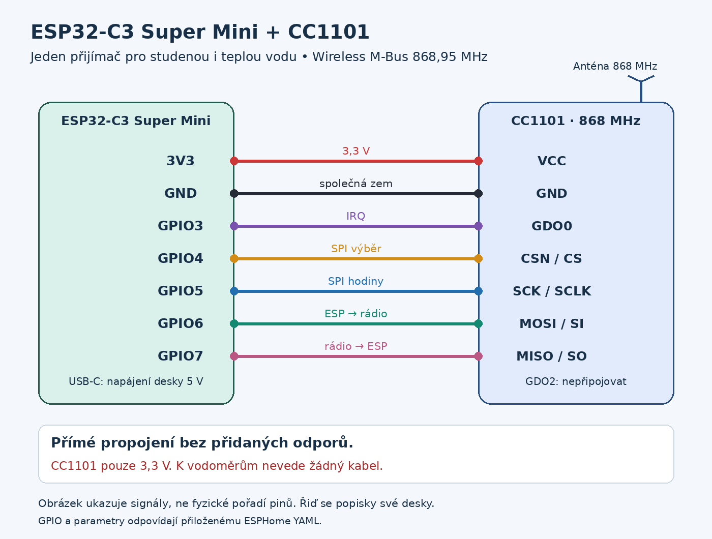
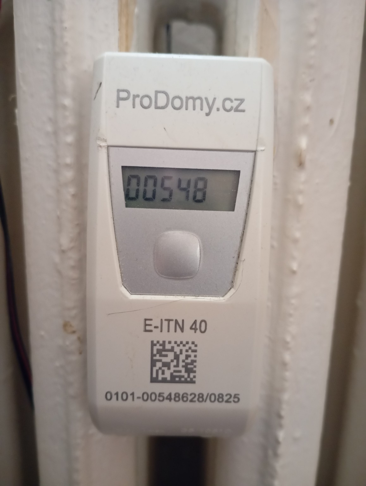
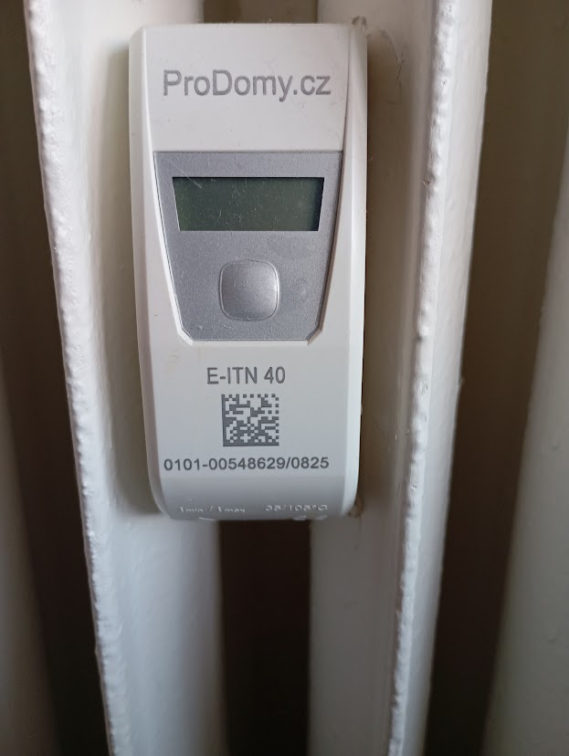
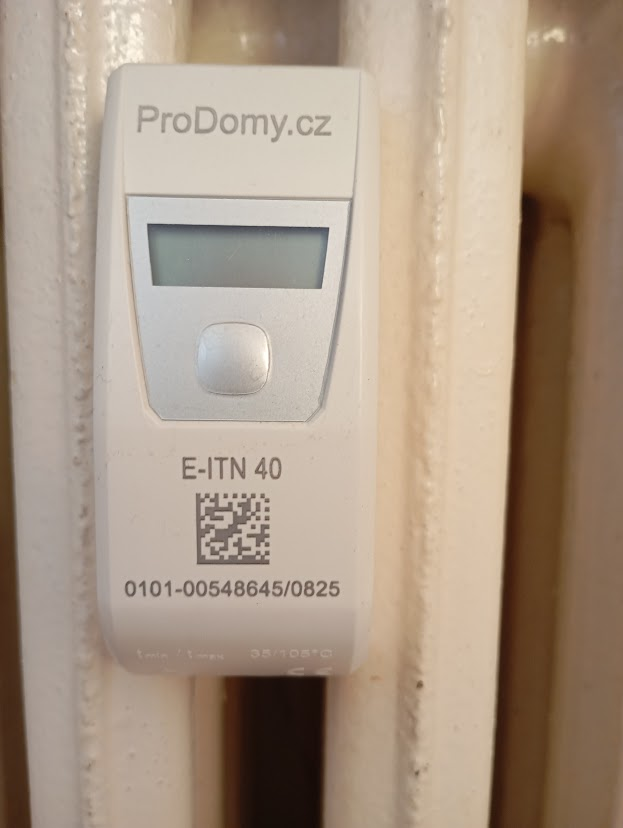
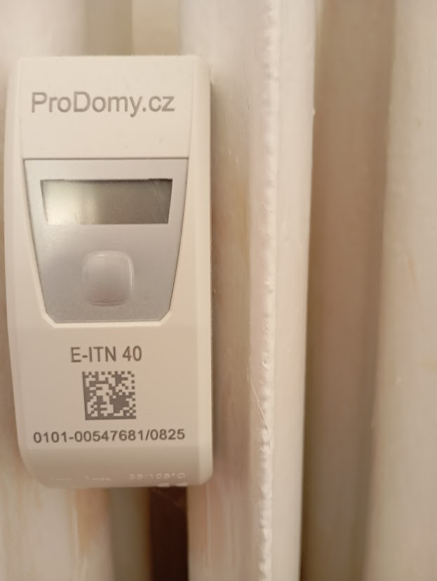

# Rozšíření: voda + E-ITN 40 (1.1.0)

Jeden ESP32-C3 Super Mini + CC1101 na 868,95 MHz přijímá dva vodoměry Apator AT-WMBUS-16-2 v T1 i indikátory E-ITN 40 v C1. Zapojení zůstává stejné, bez přidaných odporů. Rádio je napájené 3,3 V; GDO2 se nepřipojuje. Se samotnými měřidly není žádný kabelový spoj.

## Fotografie a identifikace

Fotografie dodal vlastník referenční instalace. Číslo na štítku určilo příslušnost; RSSI ani sousední výrobní čísla nejsou důkazem vlastnictví. Displej posouvá dlouhé výrobní číslo, takže `00548` na fotografii obýváku není náměr.

| Místnost | ID v ESPHome | Štítek | Fotografie |
|---|---|---|---|
| Obývák | `0x00548628` | `0101-00548628/0825` |  |
| Kuchyň | `0x00548629` | `0101-00548629/0825` |  |
| Ložnice | `0x00548645` | `0101-00548645/0825` |  |
| Pokoj | `0x00547681` | `0101-00547681/0825` |  |

1. Zapište ID ze štítků; případnou identifikaci přes posouvající se displej sledujte celou.
2. Použijte diagnostický YAML a sbírejte telegramy. BCD adresa v bajtech 4–7 je little-endian, např. `28 86 54 00` = `00548628`.
3. Vyberte jen vlastní ID. Délka vzorku musí pokrýt vysílací interval; v našich logách přibližně 159 sekund, některé zprávy se ztratily.
4. Ověřte hodnoty displejem. Obývák: aktuální rok 149, minulý rok 114 se symbolem SM. Výrobní číslo není spotřeba.

## Instalace a aktualizace

### ESPHome
1. Zálohujte fungující YAML. Jméno zařízení zůstává `vodomer-c3`; zachovejte API klíč, Wi-Fi a existující názvy vodních senzorů.
2. Zkopírujte [vodomer-c3-topeni.yaml](../esphome/vodomer-c3-topeni.yaml) do konfigurace ESPHome. Nejde o `configuration.yaml` HA.
3. Do vašeho **stávajícího** `secrets.yaml` doplňte `vodomer_api_key`, `vodomer_fallback_password`, `cold_meter_aes_key`, `hot_meter_aes_key`. `wifi_ssid` a `wifi_password` ponechte. [Vzor secrets](../esphome/secrets.example.yaml) obsahuje testovací hodnoty, ne produkční přihlašovací údaje.
4. Nastavte `meter_tepla_id`, `meter_studena_id` a čtyři `heat_*_id` (8 číslic bez `0x`; prefix doplní kód). ID topení se promítnou i do názvů nových entit.
5. Rozšířený YAML vychází z uživatelovy funkční konfigurace s názvy `Teplá voda celkem` / `Studená voda celkem`. Pokud jste používali repozitářový YAML 1.0.0 s `Tepla voda radio` / `Studena voda radio` a friendly_name `Vodomer C3`, ponechte tyto původní názvy, aby se nepřerušila návaznost entity registry. Již nahraná verze z tohoto vlákna názvy měnit nepotřebuje.
6. Validate → Install → Wirelessly. Pokud váš přijímač používá OTA heslo, zachovejte jej v sekci `ota`; rozšířená uživatelova varianta dosud heslo neměla. Nenahrazujte existující hesla vzorovými.
7. Vyčkejte 10–15 minut a ověřte oba vodoměry i čtyři indikátory. Neodstraňujte stávající integraci ESPHome.

Komponenta W-MBus je připnutá na `381afe89f39f8a7aaaae6330f214d3b4f59785b1`, shodnou se sestavením 1.0.0 i lokálně validovaným rozšířením. Žádné API klíče ani přístupové tokeny nejsou součástí release.

### HACS
HACS → tento vlastní repozitář → aktualizovat na **1.1.0** → restart HA. Doména integrace, existující entry data a unique_id vodních senzorů zůstávají stejné. Migrace nevyžaduje odebrání integrace.

V Nastavení → Zařízení a služby → **Vodoměr ESP32-C3 + CC1101** → Konfigurovat lze nově volitelně vybrat aktuální roční náměry topení. Vyberte původní senzory ESPHome s koncovkou `_aktualni`, nikoli teploty nebo archivní hodnoty. Doprovodná integrace vytvoří pomocné roční součty v dílcích; nepřevádí je na kWh. Odstranění výběru odstraní jen odpovídající pomocný senzor, ne původní ESPHome entitu.

HACS neflashuje ESP32 a automaticky nevkládá dashboard. Všech 40 podrobných entit topení vzniká nativně přes ESPHome; HACS nabízí volitelné pomocné roční součty, není podmínkou fungování karty.

### Karta HA
Dashboard → Upravit → Přidat kartu → Ruční → vložit [dashboard-topeni.yaml](../home_assistant/dashboard-topeni.yaml). Bez Mushroom, card-mod a jiných frontend doplňků. Karta hledá konce ID entit `eitn_<ID>_<pole>` bez závislosti na prefixu jména zařízení. Při vlastních ID upravte čtyři `mid` v kartě. Pokud registry přidala `_2` nebo jste ID přejmenovali, sjednoťte ID v registru nebo upravte vyhledávání v kartě. Neměňte přitom historické vodní entity.

## Nové entity pro každé měřidlo

Níže uvedené koncovky se opakují pro čtyři ID, tedy 40 nových nativních entit. ESPHome textové senzory jsou v HA také v doméně `sensor`. Příklad ID: `sensor.vodomer_c3_eitn_00548628_aktualni` (konkrétní prefix záleží na registru HA).

| Koncovka | Obsah / jednotka | Statistika |
|---|---|---|
| `aktualni` | Aktuální roční náměr, dílky | total_increasing, roční reset |
| `minuly` | Minulý roční náměr, dílky | archiv, nesčítat |
| `teplota` | Průměrná teplota okolí, registr 0, °C | measurement |
| `teplota_archiv` | Uložený průměr okolí, registr 1, °C | archiv |
| `rssi` | Signál konkrétního indikátoru, dBm | diagnostika |
| `pocet` | Přijaté vlastní zprávy od restartu ESP | není vysílací čítač měřidla |
| `stari` | Minuty od poslední platné zprávy | aktualizace po 30 s |
| `prijem` | Lokální čas příjmu Europe/Prague | text |
| `datum` | Datum z telegramu měřidla | text ISO datum |
| `archiv_datum` | Datum uloženého záznamu, u nás 2026-01-01 | ne čas příjmu |

Do prvního telegramu je stav neznámý, nikoli nula. Karta po 15 minutách bez odečtu signalizuje stáří dat. Odečty přetrvávají v HA, čítač a poslední čas v ESP se po restartu obnoví až příjmem. Rádio vysílá podle nastavení měřidel; nelze garantovat živý údaj každou minutu.

## Ověřené hodnoty z logu 6. 10. 2026

| Místnost | Aktuální rok | Minulý rok | Průměr okolí registr 0 | Uložený průměr registr 1 |
|---|---:|---:|---:|---:|
| Obývák | 149 | 114 | 21,75 °C | 21,81 °C |
| Kuchyň | 0 | 14 | 23,31 °C | 23,31 °C |
| Ložnice | 7 | 1 | 20,00 °C | 19,94 °C |
| Pokoj | 250 | 184 | 22,25 °C | 22,25 °C |

Tyto hodnoty nejsou v kódu napevno. Roční náměry obýváku potvrzuje video displeje. Nově nahraný firmware potvrdil živé dekódování obýváku, ložnice a kuchyně i pokračující vodoměry (studená 190,605 m³, teplá 122,100 m³). Pokoj byl dekódován z předchozích rádiových záznamů; krátký nový provozní log jej ještě nezachytil.

## Teploty a nepodporovaná data

`02 E5 12` / `42 E5 12`: VIF 0x65 = teplota okolí v 0,01 °C; kombinovaný VIFE 0x12 = **Average**. DIF rozlišuje storage 0 a 1. Jde o dva průměry okolí, **ne** o dvojici okamžitých teplot radiátor/místnost. Přesné průměrovací období zatím není doložené. Změny teplot při topení mohou být pomalé; nepoužívejte tyto údaje jako rychlé termostaty.

Historický kompaktní profil, další nulový náměr, stav plomby a servisní příznaky nejsou úplně dekódované. Nevytváříme neověřenou měsíční historii, procenta baterie, aktuální teplotu radiátoru ani odvozené kWh. To, že přístroj údaje uchovává či zpřístupňuje přes NFC, neznamená přítomnost ve stejném periodickém telegramu.

Dekodér přijímá jen nastavená vlastní ID, nešifrovaný APA HCA v0F, přesnou délku 103 bajtů a známé hlavičky všech záznamů. Změněný formát se odmítne. CRC a příjem zajišťuje W-MBus komponenta. Nejde o univerzální podporu všech E-ITN 40. Servisní nastavení ani plomby se nemění.

## Diagnostika

- `RX timeout after 0 bytes (need 3)`: příjem očekával začátek zprávy, který včas nedorazil. Příčinu nelze určit pouze z hlášky; vlastní platné odečty mohou současně fungovat. Při výpadcích zkontrolujte dosah, napájení a umístění antény.
- `nan min`: čeká se na první vlastní platný telegram po startu, není to nula spotřeby.
- `synchronous=` warning: upstream W-MBus registrace MQTT akce; ESPHome volí bezpečné False. Používané dekódování tím není blokované.
- Okolní měřidla se ignorují, jejich data nevytvářejí HA entity. Pro hledání používejte diagnostickou variantu a nesdílejte celé logy sousedních bytů.

## Podklady
- [Návod výrobce E-ITN 40 M2021/8b](https://www.handimex.sk/wp-content/uploads/2025/01/Manual-E-ITN-40.pdf)
- [VIF a jednotky wmbusmeters](https://github.com/wmbusmeters/wmbusmeters/blob/master/src/wmbus.cc)
- [VIFE Average 0x12](https://github.com/wmbusmeters/wmbusmeters/blob/master/src/dvparser.h)
- Vlastní fotografie, video displeje a telegramy referenční instalace.
